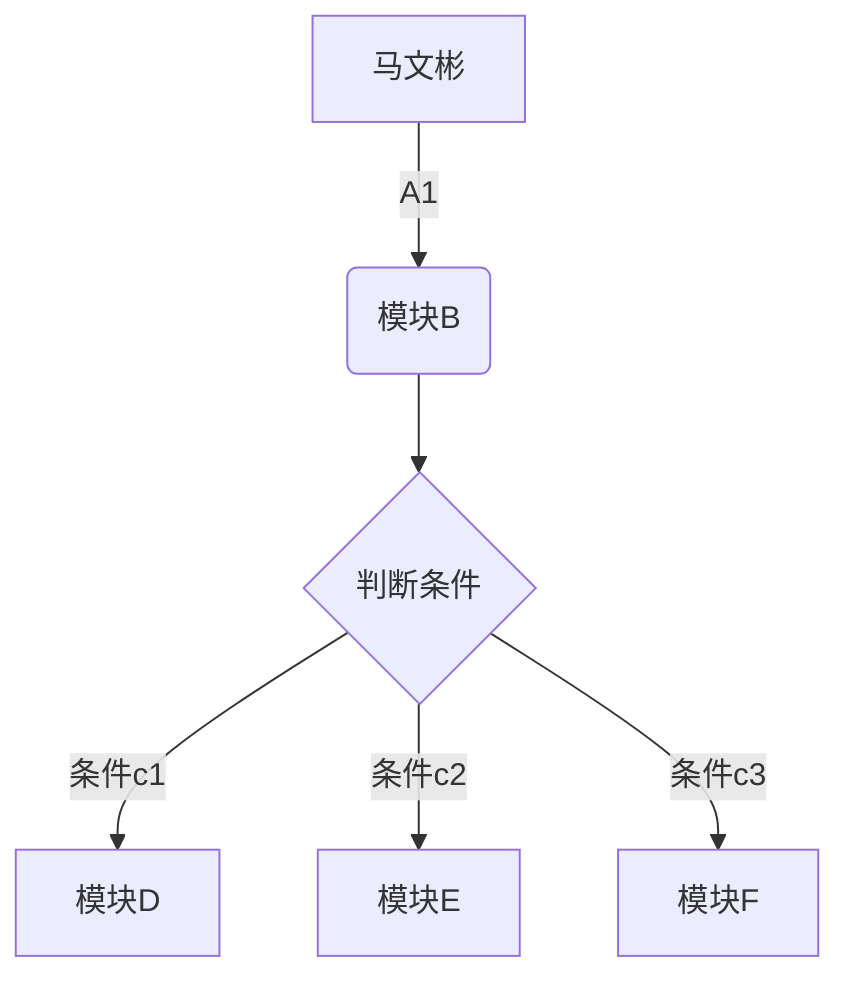

# markdown笔记

```
一级标签
二级标签
三级标签
```

> 这是没用的标签

```
<table>
    <tr>
        <td>Foo</td>
    </tr>
</table>
```

<h2 href="#h-id">段落</h2>

> 要创建段落，请使用分隔一行活多行的文本

我是一个段落

## 换行符

> 要创建换行或换行符，使用一个好多个空格结束，然后键入return

这是第一行 `<br>`这是第二行

## 强调（加粗）

> 您可以将文本设置为粗体或斜体来增加重点

我只喜欢**粗体字**

## 斜体

> 要想是文本变为斜体，请在单词或短语前后加一个星号或下划线
> 为了强调单词中间的斜体，请在字母周围添加一个不带空格的星号

我也喜欢*斜体*字 `<br>`
是吗，真的喜欢 _斜体_ 字吗   （下划线不推荐使用）

## 块引用

> 要创建一个块引用，请>在段落前加一个

```markdown
> 我是一个块引用
```

渲染的输出如下所示

> 我是一个块引用

## 带有多个段落的块引用

> 块引用可以包含多个段落，‘>’在段落之间的空白行上添加一个。

```markdown
> 我是马文斌
>
>牛逼
```

## 快引用的嵌套

```markdown
> 我是马文斌
>
>牛逼
```

> 我是马文彬
> 
> > 全世界牛逼
> > 
> > > 牛逼

## 带有其他元素的块引用

> blockquotes可以包含其他markdown格式的元素
> 所有元素都可以使用您需要尝试那些元素有效

```markdown
> ### markdown的语法学习
> - 什么是markdown
> - 支持markdown语法点工具
> - markdown的工作原理
> - markdown的基本语法
>
>真的**太好用了**，要把markdown**用起来！**
```

渲染的结果如下：

> ### markdown的语法学习
> 
> - 什么是markdown
> - 支持markdown语法点工具
> - markdown的工作原理
> - markdown的基本语法
> 
> 真的**太好用了**，要把markdown**用起来！**

## 有序列表

> 创建有序列表

1. 第一项
2. 第二项
   1. 缩进的项目1
   2. 缩进的项目2
3. 第三项
4. 第四项
5. 第五项

## 无序表

> 要创建无序列表，请在行项目前添加破折号（-），星号（*），或加号（+），缩进一项或多项以创建嵌套列表

- 第一项
- 第二项
  - 缩进的第一项
    - 缩进的第三项
    - 缩进的第四项
  - 缩进的第二项
- 第三项
- 第四项
- 第五项

## 图片


## 代码

> 要将单词或短语表示为代码，请将其阔在（`）中

语义元素事例：`<form>`,`<div>`,`<header>`有明确定义其内容

## 代码块

> 用什么语言```后就加什么语言

```html
  <div class="topbar"></div>
    <!-- header start -->
    <header class="box clearfix">
        <div class="logo"></div>
        <div class="logn"></div>
        <div class="search"></div>
    </header>
    <!-- end header -->
    <!-- main start -->
    <main class="c1 clearfix">
        <aside class="c2"></aside>
        <div class="c3">
            <div class="main"></div>
            <ul>
                <li></li>
                <li></li>
                <li></li>
                <li></li>
            </ul>
        </div>
    </main>
    <!-- end main -->
    <!-- footer start -->
    <footer></footer>
    <!-- end footer -->
```

## 水平线

> 要创建水平线，请在一行上单独使用三个或更多星号（***），破折号（---），或下划线（___）

```markdown
 *** 
 ---
 ___
```

 渲染结果如下

---

---

---

## 链接

> 要创建链接，请将链接文本放在括号中（例如：[duck duck go]）,然后跟在括号后的url

```markdown
马文彬的博客：[马文彬的博客](http://arryblog.com)
```

渲染的结果如下：
 马文彬的博客：**[马文彬的博客]**(http://arryblog.com "arry老师博客")

## url和电子邮件地址

> 要将url和电子邮件地址快速地转换为链接，请将其括在尖括号中

```markdown
<http://arryblog.com>
<3229906158@qq.com>
```

 **渲染的输出如下：**

[http://arryblog.com](http://arryblog.com) `<br>`
<3229906158@qq.com>

## 图片

> 要添加图片，请加感叹号（！），后跟括号中的替代文本，以及括号中的图像资源的路径或url，您可以选择在路径或url后添加括号中的标题

```markdown

```

**渲染后的效果：**


## 图片链接

```markdown
[
```

**渲染后的效果：**`<br>`
[](http://arryblog.com)

## 转义符

```markdown
*如果没有反斜杠，这将是列表项目的符号
- 无序列表
# 标题1
```

**渲染结果如图：**

\*如果没有反斜杠，这将是列表项目的符号 `<br>`
\-无序列表 `<br>`
\# 标题1

## HTML

> markdown中支持HTML语法

this **word** is bold. this
`<em>`word `<em>` is italic.

### HTML 最佳实践

您不能在块级HTML中使用markdown语法。例如：`<p>italic and **bold**</p>`不会工作

## 表格

> 若要添加表，请使用三个或更多连字符 （---） 创建每列的标题，并使用竖线 （|） 分隔每列。为了兼容，还应在行的任一端添加一个管道。

```markdown
|语法|描述|
|----|-----|
|标题|标题|
|段落|段落|
```

**渲染效果：**

| 语法  | 描述  |
| --- | --- |
| 标题  | 标题  |
| 段落  | 段落  |

## 表格内容的对齐方式

> 通过在标题行中连字符的左侧、右侧或两侧添加冒号 （），可以将列中的文本向左、向右或居中对齐

```markdown
| Syntax      | Description | Test Text     |
| :---        |    :----:   |          ---: |
| Header      | Title       | Here's this   |
| Paragraph   | Text        | And more      |
```

**渲染效果：**

| Syntax    | Description | Test Text   |
| --------- |:-----------:| -----------:|
| Header    | Title       | Here's this |
| Paragraph | Text        | And more    |

| ======语法 | =====段落 | =====测试 |
|:-------- |:-------:| -------:|
| 马文彬      | 马文彬     | 马文彬     |
| 马文彬      | 马文彬     | 马文彬     |

## 围栏代码块

```markdown

```

{
  "firstName": "John",
  "lastName": "Smith",
  "age": 25
}

```

```

**渲染结果如下：

```json
{
  "firstName": "John",
  "lastName": "Smith",
  "age": 25
}
```

## 脚注

这是一个简单的脚注，[^1],这是一个更长的脚注，[^2]

## 标题 ID

> 许多 Markdown 处理器支持标题的自定义 ID — 一些 Markdown 处理器会自动添加它们。通过添加自定义 ID，您可以直接链接到标题并使用 CSS 对其进行修改。若要添加自定义标题 ID，请将自定义 ID 括在与标题相同的行上的大括号中。

```markdown
### 我是标题标签{#h-id}
```

**HTML如下：**

```html
<h3 id="custom-id">My Great Heading</h3>
```

### 链接到标题 ID

[标题](#h-id)

### 删除线

> 您可以通过在单词的中心放置一条水平线来删除单词。结果如下所示。此功能允许您指示某些单词是错误，并不意味着要包含在文档中。要删除线单词，请在单词前后使用两个波浪号 （）。~~

```markdown
~~马文彬~~最帅，不对，很帅
```

**渲染结果如下：**

~~马文彬~~最帅，不对，很帅

## 表情符号

> 有两种方法可以将表情符号添加到 Markdown 文件：将表情符号复制并粘贴到 Markdown 格式的文本中，或键入_表情符号短代码_。

😍

## 强调

`<mark>`强调 `</mark>`

## 自动url链接

arry老师博客：http://arryblog.com

## 禁用url链接

```markdown
http://arryblog.com
```

## 流程图

| 表述       | 说明      | 含义                         |
| -------- | ------- | -------------------------- |
| id[文字]   | 矩形节点    | 表示流程的每一个环节                 |
| id(文字)   | 圆角矩形节点  | 表示开始和结束                    |
| id{文字}   | 菱形节点    | 表示判断，决策                    |
| id>文字]   | 右向旗帜形节点 |                            |
| id((文字)) | 圆形节点    | 表示连接，为避免流程过长或有交叉，可将流程切开，成对 |

```markdown
graph TD
A[马文彬]-->|A1| B(模块B)
B-->C(判断条件)
C-->|条件c1| D[模块D]
C-->|条件c2| E[模块E]
C-->|条件c3| F[模块F]
```


